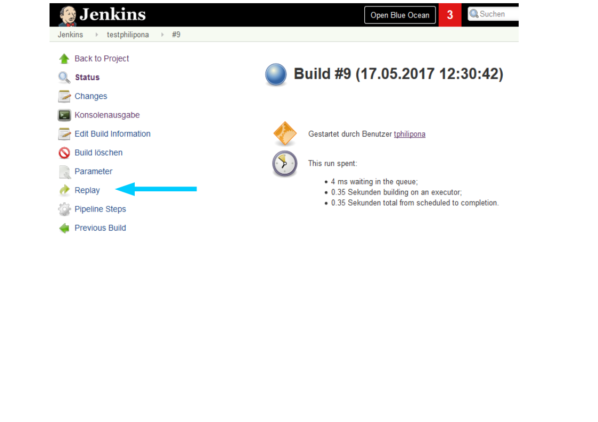
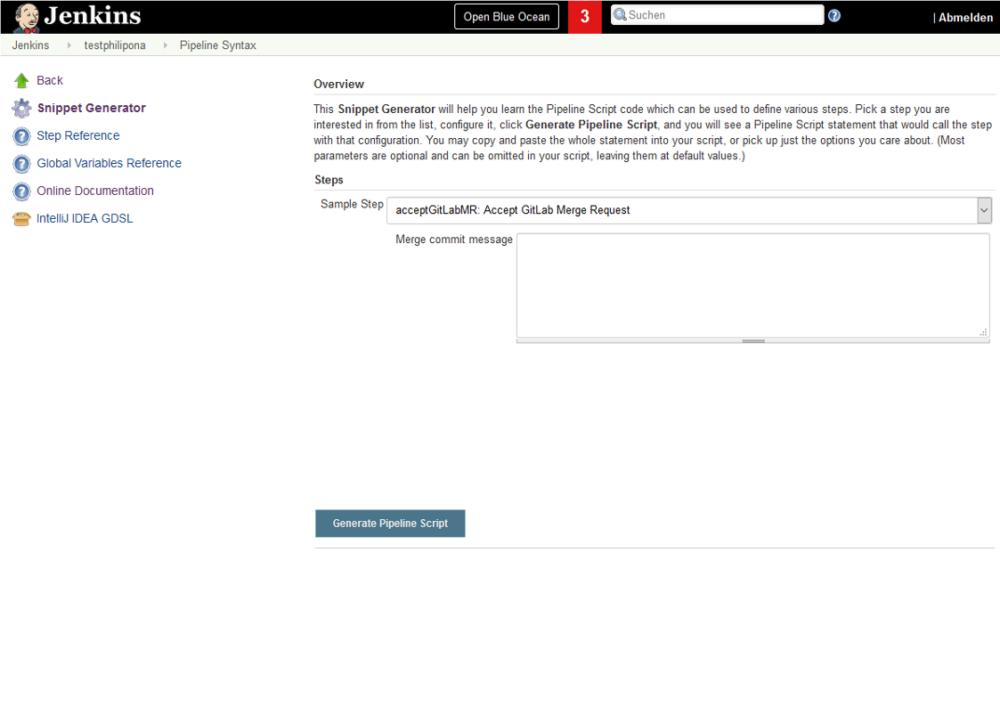

<!--section -->
# Jenkins Pipeline - Pipeline as Code

<!-- .slide: class="master02" -->

---

## Agenda

* Introduction into Jenkins Pipeline and CI/CD, **60'**
* Setup Lab Environment, **30'**
* Hands-on Techlab, **Rest of the Day**
* Recap and Feedback, **15'**

---

## Objectives

* Learn about Jenkins best practices
* Learn how to write Pipelines
* Learn about the different kinds of implementations
* Get a basic toolset on how to implement the basic use cases

---

<!--section -->
# Jenkins Overview - CI/CD

<!-- .slide: class="master02" -->

---

## Jenkins Basic Overview


---

## Jenkins Basic Info

* Consists of Masters
  * Stateful
  * Management of Jobs, Credentials, ...
  * Plugins (always run on master)
* and Slaves
  * Actually run the jobs
  * Stateless

---

## Scaling a Build Infrastructure

* jobs = number of developers * 3.333
* masters = number of jobs/500
* executors = number of jobs * 0.03

Source: https://jenkins.io/doc/book/architecting-for-scale/

---

## Why a CI Server?


---


Source: http://jnatoli.deviantart.com/

---

## Continuous Integration

* Code in scm
* Check-in and push at least daily
* Automated compiling, testing, integrating and building
* Reporting and code analysis
* Deploy to integration environment

---

## Continuous Delivery

“CONTINUOUS DELIVERY IS THE ABILITY TO GET CHANGES OF ALL TYPES—INCLUDING NEW FEATURES, CONFIGURATION CHANGES, BUG FIXES AND EXPERIMENTS—INTO PRODUCTION,OR INTO THE HANDS OF USERS, SAFELY AND QUICKLY IN A SUSTAINABLE WAY.”

-Jez Humble, continuousdelivery.com

---

## Continuous Delivery

“CONTINUOUS DELIVERY IS THE ABILITY TO GET CHANGES OF **ALL TYPES**—INCLUDING NEW FEATURES, CONFIGURATION CHANGES, BUG FIXES AND EXPERIMENTS—INTO PRODUCTION,OR **INTO THE HANDS OF USERS, SAFELY AND QUICKLY IN A SUSTAINABLE WAY.**”

-Jez Humble, continuousdelivery.com

---

## Continuous Delivery Pipeline


---

## Continuous Delivery != Continuous Deployment


---

<!--section -->
# Pipelines

<!-- .slide: class="master02" -->

---

## Why should we use Pipelines

* Developer Experience
* Self contained
* Fully automated and documented
* Reusable

---

## Pipeline Advantages

* Can be reviewed, forked, iterated upon and audited
* Running pipelines survive master restart
* Can stop and wait for human input
* Support complex CI/CD requirements
* DSL can be extended through shared libraries

---

## Declarative vs Scripted (imperative)

* Declarative: Validation => better error reporting
* Declarative: Better GUI support (Blue Ocean)
* Scripted: Rapid prototyping
* Scripted: Nearly full power of Groovy (good and bad)

---

## Declarative

```groovy
pipeline {
    agent any

    stages {
        stage('Build') {
            steps {
                echo 'Building...'
            }
        }
	}
}
```

---

## Scripted

```groovy
node {
    stage('Build') {
      echo 'Building...'
    }
}
```

---

## Groovy Syntax Limitations

* Pipelines must survive restart of the jenkins
* Scripts must serialize data back to the master
* Some Groovy idioms with closures not supported, e.g:
```
collection.each { item -> /* perform operation */ }
```

---

## Tools

* Jobs require different build tools
* To keep slaves stateless, tools are installed dynamically during job execution
* Jenkins provides auto tool installer concept

---

## Tools @ Puzzle

* Seeder job that manages custom tools
* Update jobs that automatically update tools where possible
* All custom tool scripts are managed in git
* Custom tools check if they already exist (performance)

---

<!--section -->
# Best Practices

<!-- .slide: class="master02" -->

---

## keep everything you need to build, deploy, test, & release in version control 

---

## Best Practices

* Use folders
* Keep the slave stateless
* Archive artifacts
* Reuse functionalities in shared libraries

---

## Best Practices Folders Plugin

How to organize pipelines @ puzzle

```
[Customer]-[project]

hit-hitobito
pitc-appuio
```

---

## Debugging a Pipeline

Use the replay function of a pipeline



---

## Debugging a Pipeline

Use the replay function of a pipeline


---

## Snippet Generator 


---

## Snippet Generator 



---

## Glossary

| Term | Description |
|---|---|
| Pipeline  | A user-defined model of a continuous delivery pipeline  |
| Build  | Result of a single execution of a Project  |
| Agent  | An agent is typically a machine, or container, which connects to a Jenkins master and executes tasks when directed by the master.  |
| Node  | A machine which is part of the Jenkins environment and capable of executing Pipelines or Projects.  |
| Job  | A deprecated term, synonymous with Project.  |
| Stage  | the phases of a pipeline are called stages  |
| Step  | A single task; fundamentally steps tell Jenkins what to do inside of a Pipeline or Project.  |


---

<!--section -->
# Jenkins @ Puzzle

<!-- .slide: class="master02" -->

---

## Puzzle Jenkins Environment

* 1 master
* 1 main slave
* OpenShift docker slaves on demand

---

## OpenShift Integration (1/2)

* Currently Kubernetes plugin
* Custom slaves build with its own pipeline
* Project specific Slaves

---

## OpenShift Integration (2/2)

Prior to 1.0.14 (impl. of SimpleBuildStep)
```
step([$class: 'OpenShiftBuilder', apiURL: .....

```

After 1.0.14

```
def builder = openshiftBuild buildConfig: 'frontend'
```

---

<!--section -->
# Techlab

<!-- .slide: class="master02" -->

---

## Techlab Environment

* 1 master deployed on OpenShift techlab env
* Every participant runs its own slave locally

---

## How the Techlab Works

* Guided, hands-on Workshop
* Docs are on GitHub
* Please help us to improve the techlab

---

## Resources

* Jekins Book: <https://jenkins.io/doc/book/>
* Examples <https://jenkins.io/doc/pipeline/examples/>
* OpenShift Examples: <https://github.com/openshift/origin/tree/master/examples/jenkins/pipeline>
* Jenkins Techlab: <https://github.com/puzzle/jenkins-techlab>

---

## Let's Start 

<https://github.com/puzzle/jenkins-techlab>

---
