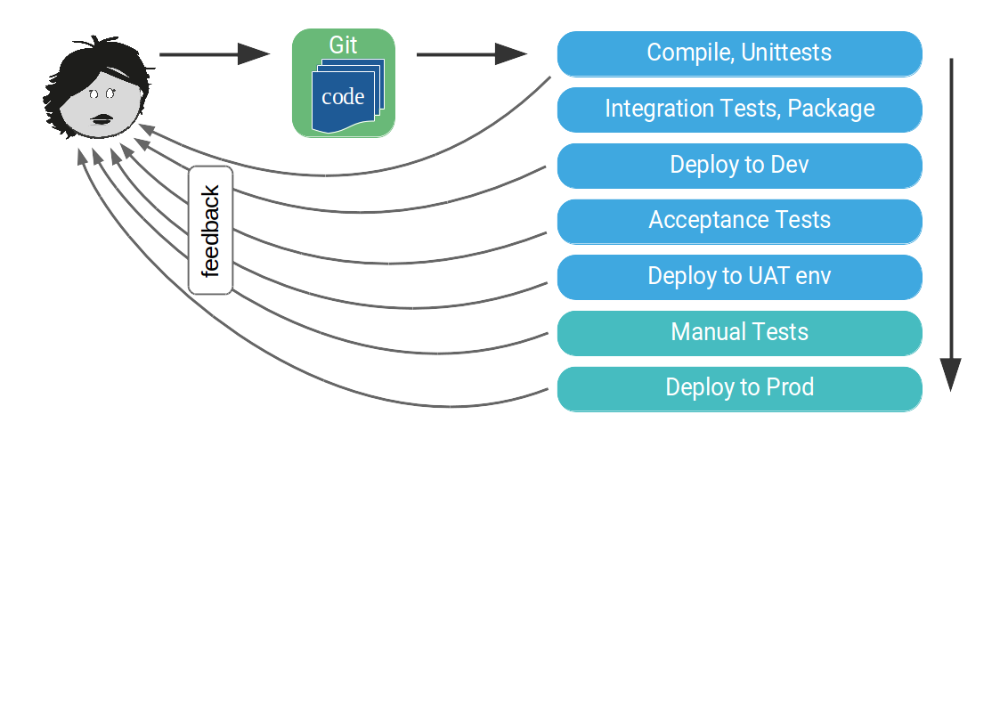
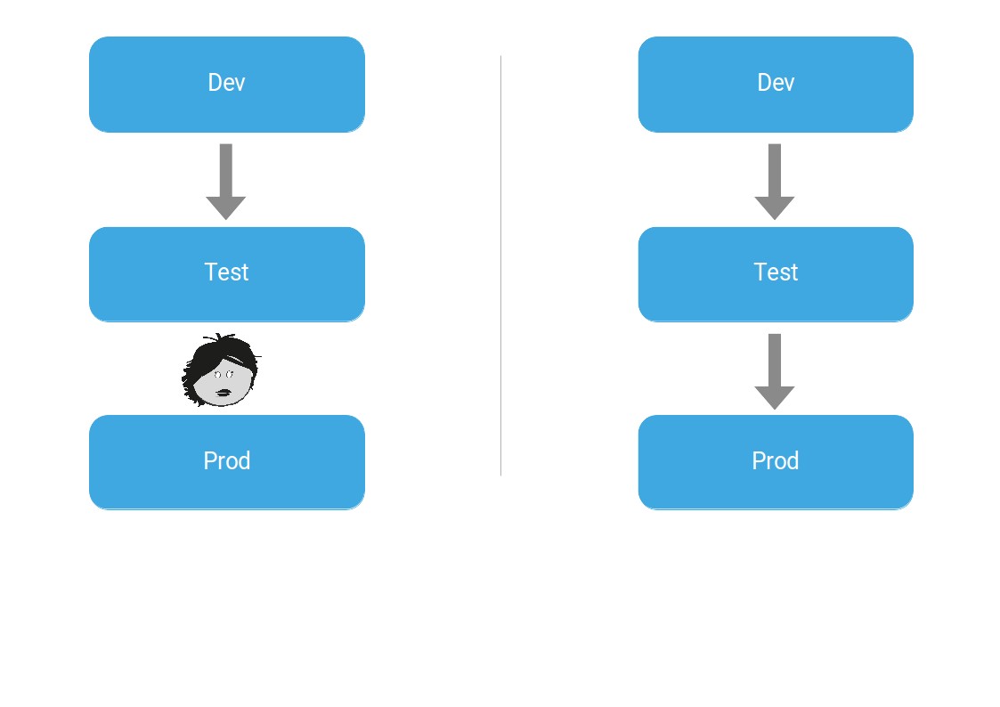

<!--section -->
# Jenkins Pipeline - Pipeline as Code

<!-- .slide: class="master02" -->

---

## Agenda

* Jenkinsfile Intro
  * General Intro and purpose
     * Why should we use pipelines (see book) https://jenkins.io/doc/book/blueocean/#why-does-blue-ocean-exist
  * Glossar https://jenkins.io/doc/book/glossary/
  * Advantages
  * Imperative
  * Declarative <https://jenkins.io/doc/book/pipeline/syntax/>
  * Tooling Custom Tools
  * Best Practices
    * Folders
    * Slaves stateless
    * Shared Libraries --> Lab
  * Techlab
  * Setup (Lab and our own Jenkins)
  * OpenShift Integration
  * Jenkins Book
  * Examples
    * <https://jenkins.io/doc/pipeline/examples/>
    * <https://github.com/openshift/origin/tree/master/examples/jenkins/pipeline>

* global defaults, e.g. logrotate
https://jenkins.io/blog/2017/02/15/declarative-notifications/

https://www.cloudbees.com/sites/default/files/2016-jenkins-world-introducing_a_new_way_to_define_jenkins_pipelines_1.pdf

* Setup
* Hello Pipeline
* Stages, Locks, Milestones
* Build properties
   * log rotate
   * scm trigger
   * cron trigger
* Artefact archiving/stashing
* Credentials
  * ssh-agent
  * with_credentials
* Umgebungsvariabeln
* Build Tools
  * tools()
  * Automatisierung Puzzle
* Snippet Generator
* Error handling
* Quoting/Escaping
* Notification
  * mail
  * rocketchat
  * swoa committer only
* Debugging
   * replay
   * https://jenkins.io/doc/book/pipeline/development/
   * ...?
* Shared Libraries
* Multibranch
* OpenShift 3 Integration
  * Both plugins
* OpenShift Image Triggers
* OpenShift Slaves
* Image Promotion
* Blue Ocean

---

## Agenda

* Introduction into Jenkins Pipeline and CI/CD, 60'
* Setup Lab Environment, 30'
* Hands-on Techlab, Rest of the Day
* Recap and Feedback, 15'

---

## Objectives

* Learn about jenkins bestpractices
* Learn how to write Pipelines
* Learn about the different kinds of implementations
* Get a basic toolset on how to implement the basic use cases

---

## Jenkins Basic Info

TODO image (master and slaves)

* Consists of Masters
  * Statefull
  * Management of Jobs, Users, Credentials, ...
  * Plugins (always run on master)
* and Slaves
  * Actually run the Jobs
  * Stateless

---

## Scaling a Build Infrastructure

* jobs = number of developers * 3.333
* masters = number of jobs/500
* executors = number of jobs * 0.03

Source: https://jenkins.io/doc/book/architecting-for-scale/

---

## Why a CI Server?


---


Source: http://jnatoli.deviantart.com/

---

## Continuous Integration

* code in scm
* check-in and push at least daily
* automated compiling, testing, integrating and building
* reporting and code analysis
* deploy to integration environment

---

## Continuous Delivery

“CONTINUOUS DELIVERY IS THE ABILITY TO GET CHANGES OF ALL TYPES—INCLUDING NEW FEATURES, CONFIGURATION CHANGES, BUG FIXES AND EXPERIMENTS—INTO PRODUCTION,OR INTO THE HANDS OF USERS, SAFELY AND QUICKLY IN A SUSTAINABLE WAY.”

-Jez Humble, continuousdelivery.com

---

## Continuous Delivery

“CONTINUOUS DELIVERY IS THE ABILITY TO GET CHANGES OF **ALL TYPES**—INCLUDING NEW FEATURES, CONFIGURATION CHANGES, BUG FIXES AND EXPERIMENTS—INTO PRODUCTION,OR **INTO THE HANDS OF USERS, SAFELY AND QUICKLY IN A SUSTAINABLE WAY.**”

-Jez Humble, continuousdelivery.com

---

## Continuous Delivery Pipeline



---

## Continuous Delivery != Continuous Deployment



---

## Why should we use Pipelines

* Developer Experience
* Selfcontained
* Fully automated and documented
* Reusable

---

## Pipeline Advantages

* Can be reviewed, forked, iterated upon and audited
* Running pipelines survive master restart
* Can stop and wait for human input
* Support complex CI/CD requirements
* DSL can be extended through shared libraries

---

## Declarative vs Scripted

* Declarative: Validation => better error reporting
* Declarative: Better GUI support (Blue Ocean)

---

## Custom Tools

TODO: how to use, what's the idea behind it, how to update, install other tools

---

## Best Practices

* use folders
* keep the slave stateless
* archive artifacts
* reuse functionalities in shared libraries


---

## Puzzle Jenkins Environment

* 1 master
* 1 main slave
* OpenShift docker slaves on demand

---

## OpenShift Integration (1/2)

* currently Kuberentes plugin
* custom slaves build with its own pipeline
* project specific Slaves

---

## OpenShift Integration (2/2)

prior to 1.0.14 (impl. of SimpleBuildStep)
```
step([$class: 'OpenShiftBuilder', apiURL: .....

```

after 1.0.14

```
def builder = openshiftBuild buildConfig: 'frontend'
```

---

## Techlab Environment

* 1 master deployed on OpenShift techlab env
* every participant its own slave localy


---

## Resources

* Jekins Book: <https://jenkins.io/doc/book/>

----
